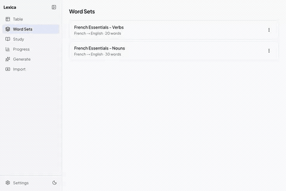

# Lexica

Self-hostable language learning app with spaced repetition flashcards. Generate vocabulary from frequency lists, import existing decks, and track your progress — all stored locally in SQLite.

> Built almost entirely through vibe coding to test the capabilities of latest models.



## Features

- **Spaced repetition** — SM-2 algorithm with interval previews and session summaries
- **Word generation pipeline** — frequency lists + Wiktionary definitions + Tatoeba example sentences
- **Predefined sets** — curated French & Spanish word sets (nouns + verbs) ready to load
- **Import** — CSV/TSV files, Anki decks (.apkg), and predefined sets
- **Export** — word sets to CSV
- **Text-to-speech** — Kokoro TTS via a Python sidecar (EN, FR, ES)
- **Progress tracking** — accuracy charts, streaks, learning history
- **Multi-language** — EN, FR, ES, DE, IT, PT, NL, TR, JA, KO, ZH

## Tech Stack

Next.js 16 · React 19 · TypeScript · Tailwind CSS 4 · shadcn/ui · Drizzle ORM · SQLite · SWR

## Getting Started

```bash
npm install
npm run dev
```

Open [http://localhost:3000](http://localhost:3000).

### Text-to-Speech (optional)

The TTS feature requires a Python sidecar running Kokoro:

```bash
cd tts-sidecar
docker build -t lexica-tts .
docker run -p 8000:8000 lexica-tts
```

## Project Structure

```
src/
├── app/                 # Pages and API routes
│   ├── flashcards/      # Study interface
│   ├── generate/        # Word generation pipeline
│   ├── import/          # CSV & Anki import
│   ├── table/           # Word table view
│   ├── progress/        # Stats & charts
│   ├── settings/        # Backup & config
│   ├── word-sets/       # Set management
│   └── api/             # Backend endpoints
├── components/          # React components
├── hooks/               # SWR data hooks
└── lib/
    ├── db/              # Drizzle schema & migrations
    ├── pipeline/        # Generation pipeline (frequency, wiktionary, tatoeba)
    ├── import/          # CSV & Anki parsers
    └── sm2.ts           # Spaced repetition algorithm
scripts/                 # CLI tools (predefined set generator)
tts-sidecar/             # FastAPI TTS server
data/predefined-sets/    # Generated word set JSON files
```

## Database

SQLite with WAL mode, stored at `data/lexica.db`. Schema managed by Drizzle with migrations.

Run migrations:

```bash
npx drizzle-kit migrate
```

## Scripts

| Command | Description |
|---------|-------------|
| `npm run dev` | Start dev server |
| `npm run build` | Production build |
| `npm run start` | Start production server |
| `npm run lint` | Run ESLint |

### Generating Predefined Word Sets

Generate curated word sets using frequency lists, Wiktionary, Tatoeba, and Claude Code for gap-filling:

```bash
npx tsx scripts/generate-predefined-set.ts --target fr --source en --type nouns --count 1000
```

| Flag | Description | Required |
|------|-------------|----------|
| `--target` | Learning language (fr, es, etc.) | Yes |
| `--source` | Native language (en, etc.) | Yes |
| `--type` | `nouns` or `verbs` | Yes |
| `--count` | Number of words | Yes |
| `--batch-size` | Words per LLM batch (default: 50) | No |
| `--concurrency` | Parallel LLM batches (default: 3) | No |
| `--model` | Claude model (default: sonnet) | No |
| `--force` | Overwrite existing output | No |

Output goes to `data/predefined-sets/`. The script is resumable — if interrupted, re-run with the same args to continue. Requires [Claude Code](https://claude.ai/claude-code) CLI in PATH.
